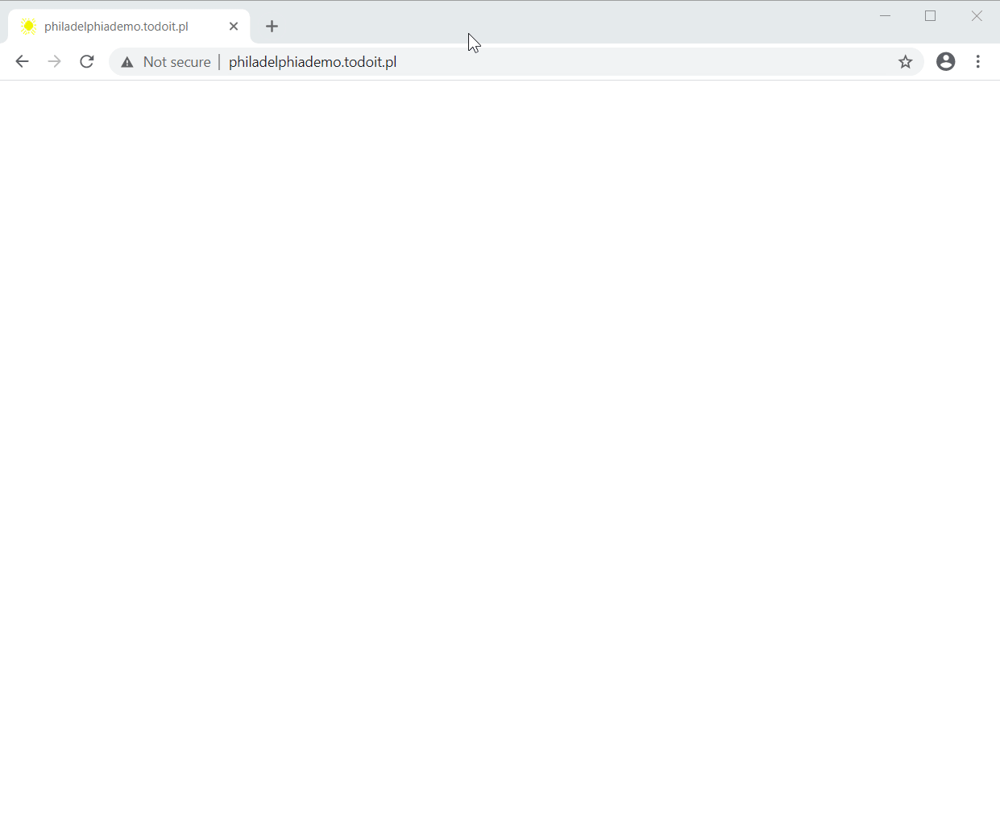

## [IAWApp Host] Industrial Android Web App Host 

Making development of Android apps in web technologies feasible. By doing that, it enables other languages such as C# to be used for Android development. By providing APIs such as QR scanning, it permits apps to be feature-rich.

## Installation and screenshots

[App's page in Google Play Store](https://play.google.com/store/apps/details?id=pl.todoit.industrialAndroidWebAppHost)

## What is it?

It is an Android app making it possible to easily write web apps posing as native Android apps. On one hand it hides URL bar, on the other it provides APIs to: 
* manage AppBar 
 back button, menu items, action buttons
* scan QR codes
* take photos
* preserve state present in fragment part of URL

and few others that you can discover while playing with built-in `Demo (local, embedded)` app. 

It is a WebView based browser with additional JavaScript APIs. WebView is in fact Google's Chromium based browser suitable for embedding in apps. App lets user permit or disallow permissions to sensitive APIs such as photo taking.

Support for APIs is also built-in into C# webapp development environment: [Philadelphia Toolkit](https://github.com/todo-it/philadelphia/).

## Can I see it in action?

Starting app presents "Known connections" to user to easily choose URL to open. By default app contains:
 * TypeScript based embedded-as-Android-asset demo app
 * TypeScript based embedded-as-Android-asset Simple QR Scanner app
 * C# based online demo app utilizing [Philadelphia Toolkit](https://github.com/todo-it/philadelphia/)

## Where can I find documentation for those additional APIs?

* TypeScript
  * [lowest level contracts](https://github.com/d-p-y/industrial-android-webapp-host/blob/master/AndroidApp/app/src/main/assets/contracts.ts)
  * [richer contracts](https://github.com/d-p-y/industrial-android-webapp-host/blob/master/AndroidApp/app/src/main/assets/richer_contracts.ts)
  * [actual usage example in Simple QR Scanner app](https://github.com/d-p-y/industrial-android-webapp-host/tree/master/AndroidApp/app/src/main/assets/SimpleQrScanner)

* C# 
  * demo app mobile entry point in [OnReadyIAWApp()](https://github.com/todo-it/philadelphia/blob/master/Philadelphia.Demo.Client/Program.cs)

## Tools needed to compile and run locally
* VSCode with TypeScript plugin
* Android Studio 4.0.2 or later

## Building

In VSCode with TypeScript installer open folder (ctrl K, ctrl O) ``\<industrial-android-webapp-host\>\AndroidApp\app\src\main\assets\ConnectionsManager``
and compile it (ctrl shift B and choose 'watch').

Do the same with folders:
* ``\<industrial-android-webapp-host\>\AndroidApp\app\src\main\assets\DemoWebSite``
* ``\<industrial-android-webapp-host\>\AndroidApp\app\src\main\assets\SimpleQrScanner``

Open ``\<industrial-android-webapp-host\>\AndroidApp`` in Android Studio and press Run button.

## How to open or develop apps in regular browser?

In browser activate Developer Tools (in Firefox&Chrome use `CTRL SHIFT I`). Afterwards switch to mobile development by activating ``Toggle device toolbar`` (in Chrome) or ``Responsive Design Mode`` (in Firefox). Last setup step is forcing UserAgent to be ``IndustrialAndroidWebApp``. Now you are ready to open URL with your app.

## Authors

Dominik Pytlewski 

## License

Apache License 2.0
